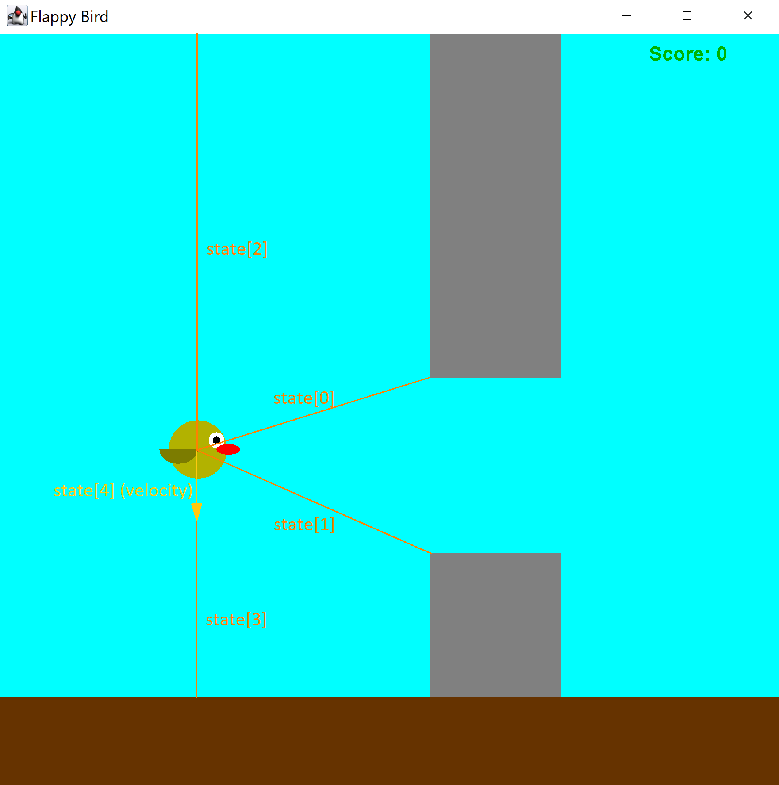

# FlappyBird Game Bot

## What?
- A game of FlappyBird that you can play normally 
- A group of birds that have been carefully breeded and selected through tens of thousands of generations to survive FlappyBird.
- A standalone bot that have been trained on hundreds of thousands of gameplay and learned to avoid dying.
- Best of all: everything, including matrix multiplication, is implemented from scratch! (unless you count the basic graphic APIs).

## Why?
This is the final project for CSCI 5611 - Animation & Planning in Games, where we were asked to choose among the following topics:
- Option 1 – Realistic-as-possible Simulation
- Option 2 – Short (20-40s) Computer Animated Story
- Option 3 – Game or Interactive Demo
- Option 4 – Implement an Animation or Planning Technique

My project is related to both options 3 and 4. At first, I chose to just implement a simple Flappy Bird game via option 3. Then, my ambition and curiosity got the best of me, prompting me to ask, "why could we not program an algorithm to win the game?"

## How?
### Libraries utilized:
We try to keep our tools minimalistic:
- [Java Abstract Window Toolkit (AWT)](https://docs.oracle.com/javase/7/docs/api/java/awt/package-summary.html) provides basic functionality for creating graphical interfaces.
- [Javax Swing](https://docs.oracle.com/javase%2F7%2Fdocs%2Fapi%2F%2F/javax/swing/package-summary.html) is an extension of AWT and is used hand-in-hand with AWT.
- Some other basic modules include java.util, java.io, and java.nio.

### The standalone user-interactive FlappyBird game
There are 3 main classes/components that I used to implement a simple version of FlappyBird:
- Environment: pillar generation and display
- Player: update the bird's velocity, height, and wing flapping
- Game: update and draw the frames, as well as reacting to user input (whether they hit space).


### How to win the game?

We can reformulate the problem as follows: assuming we retrieve the game state from a particular frame during gameplay, what action (jump or no jump) should the bird take that would lead to the highest chance of survival? 

#### State and action representation
<div style="text-align: center;">

</div>
<br/>
A state is represented as a list of 5 numbers:

0. Distance from the bird to the nearest pillar's top
1. Distance from the bird to the nearest pillar's bottom
2. Distance from the bird to the ceiling
3. Distance from the bird to the ground
4. Velocity of the bird

Note that for neural networking training purposes, all the above numbers are normalized by the maximum value each can take.

An action, on the other hand, is a binary number: 1 if jump and 0 otherwise.

#### Approach 1: Genetic algorithm
<div style="text-align: center;">

</div>
<br/>

This approach employs survival-of-the-fittest scheme: 
- Initially we have n birds, each of which is a neural network with randomized parameters, simultaneously playing the game. The neural network is a parameterized function that outputs an action given a state.
- We let the birds play the game until everyone dies.
- The next generation of birds are selected as follow:
    - $k$ birds are sampled directly
    - $m$ birds are mutated samples. To mutate, we add some gaussian noise to 10% of the bird's neural network parameters.
    - $c$ birds are bred using pairs of samples. To breed, we randomly cut each layer of each bird. The newborn bird's resulting layer will be the top half of the first bird concatenated with the second half of the second bird, a little bit like chromosomal crossovers.
    - By sampling, we use random sampling, weighted over the bird's fitness score, which is the number of pipes the bird has survived through. Also, instead of sampling from just the previous generation, we use the sample space of birds from every generation up to the current one. This biased sampling will (hopefully) allow us the birds to converge to an optimal fitness score.
- The cycle of life continues... until one of the birds passed through the $terminalScore$ (which is set to 1,000,000) of pillars.

#### Approach 2: Deep Q-Learning algorithm
Now, you may ask, why do we need so many birds? Can't we just have a single bird? Isn't the feedback from the environment (whether it dies or not given a particular state/action) enough for the bird to learn by itself?

<div style="text-align: center;">

</div>
<br/>

The answer obviously is yes. Given a neural network that takes in a pair of state and action and outputs a number that tells us how well it is doing, if somehow we can accurate train this neural network, it means that at every state, we can just choose the action so as to maximize such number.

WARNING: details are pretty long, but I guarantee that it is worth reading.

What number should we use, you may ask?
- How many frames until it is expected to die? This number could potentially be very large, and possibily infinite (in fact, isn't that our goal?). Furthermore, do we really care if it survives in 100000 frame from now as much as we care if it will survive within the next 80 to 100 or-so frames.
- A binary number representing whether we will die or not in the next frame? Or better, a floating number indicating the probability of dying? Both of these only look at the imminent effect of our action. However, what if the action we take might be less optimal in the next frame but better in the long run? Suppose we are approaching our first pillar which has a gap near the ground. If we just looking at whether it dies in the next frame, we would not choose to fly near the ground since this would have a higher chance to crashing into the ground. However, if we are careful about it, flying near the ground when we see the first pillar coming in might be a more optimal strategy since that would allow us to pass the first pillar.
- How about combining the two above methods? We can assign a score of a particular state as follows:

    - $G_t = R_{t} + \gamma R_{t + 1} + \gamma^{2} R_{t + 2} + \ldots + \gamma^{T - t} R_{T} $

    - $R_{t}$ is the "reward" the bird gets at frame $t$ (the bird should get higher reward if it survives vs if it dies).
    - $\gamma$ is a tunable hyperparameter that controls how much do we care about future rewards?

Training the a neural network that learns the mapping: $(State_{t}, Action_{t}) \rightarrow G_{t}$. Sounds simple enough? But there are still some potential problems:
- At the start, the state does not change much. How can we prevent the bird from always doing one particular action (i.e. always jump)? This can lead to the bird dying shortly after the game starts and never get the chance to explore other states. To prevent this, we have a hyperparameter $\epsilon$ that controls whether we want to explore new states by taking a random action or whether we want to act according to the neural network's evaluation of the state and action. Initially, $\epsilon$ is set really high so that we can sample as many states as possible but gradually decreases when the bird's performance gets better.
- What if learning from new states causes the parameters to change so much that the network forget about past states that we have already encountered (you never whether past states may show up during gameplay)? We can balance the current and past experiences by storing a memory buffer of past state-action pairs encountered. After each gameplay, we sample a minibatch from this memory buffer to train the network.
- Conversely, what if learning from past experiences disrupt the network ability to discover new states? For example, there might cases the bird has luckily learn how to pass 5 pillars, but fails on the 6th one. Since such occurances are so rare  during the initial stage of training, it will take a lot of time to ever get into the same stage again. Furthermore, learning from memory will cause the bird to optimize old data rather than ones that are relevant for the neural network to discover new states (i.e. states that are beyond the 5th pillars). This is actually the case I found when I was initially training my model. To fix this, I added a game replay buffer (which is different than the memory buffer mentioned in the previous bullet point). The game buffer stores the entire state of the game, including the environment's and the player's attributes of the last 30-90 frames before the bird dies. At every epoch, instead of resetting the game from the beginning, there is a 75% chance that it will load one of the previous game state from the game buffer instead.

<br/>
The pseudocode for the training algorithm can be written as follows:

```python
net = NeuralNetwork()
net.initialize()

stateMemory = []
gameMemory = []

for epoch in range(maxEpochs):
    eps = epsEnd + (epsStart - epsEnd) * exp(-epoch/epsDecay);  
    if random() < .25:
        player.reset()
        env.reset()
    else:
        player, env = sample(gameMemory, 1)
    
    states = []
    frames = []
    while player.score <= terminalScore:
        frames.add((player.copy(), env.copy()))
        state = getState(player, env)
        if random() < eps:
            action = randomBool()
        else:
            action = 0 if net.forward([state, 0]) >= net.forward([state, 1])

        player.update()
        env.update()

        if gameOver(player, env):
            states.add((state, action, -100))
        else:
            states.add((state, action, 0))
    
    for i in range(len(states) - 2, -1, -1):
        states[i][2] += states[i + 1][2] * gamma
    states.standardizeRewards()
    stateMemory.extend(states)
    if frames.size() >= 100:
        gameMemory.extend(frames[-90:-30])

    batch = sample(stateMemory, batchSize)
    loss = sum((net.forward(batch))) / batchSize
    net.step(loss)

    evaluate()
    if player.score > terminalScore:
        net.save()
        break
```


## Low level details


 
