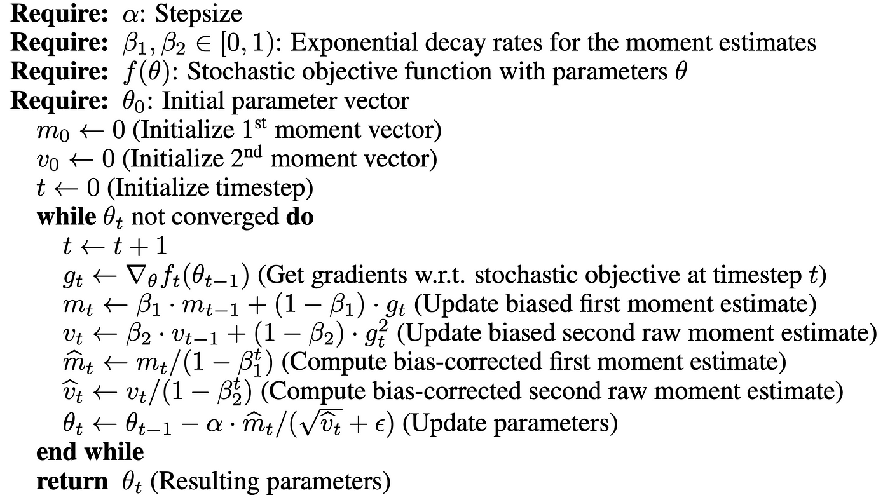

# FlappyBird Game Bot

## What?
- A game of FlappyBird that you can play normally 
- A group of birds that have been carefully breeded and selected through tens of thousands of generations to survive FlappyBird.
- A standalone bot that have been trained on hundreds of thousands of gameplay and learned to avoid dying.
- Best of all: everything, including matrix multiplication, is implemented from scratch! (unless you count the basic graphic APIs).

## Why?
This is the final project for CSCI 5611 - Animation & Planning in Games, where we were asked to choose among the following topics:
- Option 1 – Realistic-as-possible Simulation
- Option 2 – Short (20-40s) Computer Animated Story
- Option 3 – Game or Interactive Demo
- Option 4 – Implement an Animation or Planning Technique

My project is related to both options 3 and 4. At first, I chose to just implement a simple Flappy Bird game via option 3. Then, my ambition and curiosity got the best of me, prompting me to ask, "why could we not program an algorithm to win the game?"

## How?
### Libraries utilized:
We try to keep our tools minimalistic:
- [Java Abstract Window Toolkit (AWT)](https://docs.oracle.com/javase/7/docs/api/java/awt/package-summary.html) provides basic functionality for creating graphical interfaces.
- [Javax Swing](https://docs.oracle.com/javase%2F7%2Fdocs%2Fapi%2F%2F/javax/swing/package-summary.html) is an extension of AWT and is used hand-in-hand with AWT.
- Some other basic modules include java.util, java.io, and java.nio.

### The standalone user-interactive FlappyBird game
There are 3 main classes/components that I used to implement a simple version of FlappyBird:
- Environment: pillar generation and display
- Player: update the bird's velocity, height, and wing flapping
- Game: update and draw the frames, as well as reacting to user input (whether they hit space).


### How to win the game?

We can reformulate the problem as follows: assuming we retrieve the game state from a particular frame during gameplay, what action (jump or no jump) should the bird take that would lead to the highest chance of survival? 

#### State and action representation
<div style="text-align: center;">

</div>
<br/>
A state is represented as a list of 5 numbers:

0. Distance from the bird to the nearest pillar's top
1. Distance from the bird to the nearest pillar's bottom
2. Distance from the bird to the ceiling
3. Distance from the bird to the ground
4. Velocity of the bird

Note that for neural networking training purposes, all the above numbers are normalized by the maximum value each can take.

An action, on the other hand, is a binary number: 1 if jump and 0 otherwise.

#### Approach 1: Genetic algorithm
<div style="text-align: center;">

</div>
<br/>

This approach employs survival-of-the-fittest scheme: 
- Initially we have n birds, each of which is a neural network with randomized parameters, simultaneously playing the game. The neural network is a parameterized function that outputs an action given a state. In the real implementation, we actually have the network outputs a stochastic action (i.e. a probability $p$ of jumping instead of a hard 0 or 1); we can get the action by setting a threshold, such as $p > 0.7$.
- We let the birds play the game until everyone dies.
- The next generation of birds are selected as follow:
    - $k$ birds are sampled directly
    - $m$ birds are mutated samples. To mutate, we add some gaussian noise to 10% of the bird's neural network parameters.
    - $c$ birds are bred using pairs of samples. To breed, we randomly cut each layer of each bird. The newborn bird's resulting layer will be the top half of the first bird concatenated with the second half of the second bird, a little bit like chromosomal crossovers.
    - By sampling, we use random sampling, weighted over the bird's fitness score, which is the number of pipes the bird has survived through. Also, instead of sampling from just the previous generation, we use the sample space of birds from every generation up to the current one. This biased sampling will (hopefully) allow us the birds to converge to an optimal fitness score.
- The cycle of life continues... until one of the birds passed through the $terminalScore$ (which is set to 1,000,000) of pillars.

#### Approach 2: Deep Q-Learning algorithm
Now, you may ask, why do we need so many birds? Can't we just have a single bird? Isn't the feedback from the environment (whether it dies or not given a particular state/action) enough for the bird to learn by itself?

<div style="text-align: center;">

</div>
<br/>

The answer obviously is yes. Given a neural network that takes in a pair of state and action and outputs a number that tells us how well it is doing, if somehow we can accurate train this neural network, it means that at every state, we can just choose the action so as to maximize such number.

WARNING: details are pretty long, but I guarantee that it is worth reading.

What number should we use, you may ask?
- How many frames until it is expected to die? This number could potentially be very large, and possibily infinite (in fact, isn't that our goal?). Furthermore, do we really care if it survives in 100000 frame from now as much as we care if it will survive within the next 80 to 100 or-so frames.
- A binary number representing whether we will die or not in the next frame? Or better, a floating number indicating the probability of dying? Both of these only look at the imminent effect of our action. However, what if the action we take might be less optimal in the next frame but better in the long run? Suppose we are approaching our first pillar which has a gap near the ground. If we just looking at whether it dies in the next frame, we would not choose to fly near the ground since this would have a higher chance to crashing into the ground. However, if we are careful about it, flying near the ground when we see the first pillar coming in might be a more optimal strategy since that would allow us to pass the first pillar.
- How about combining the two above methods? We can assign a score of a particular state as follows:

    - $G_t = R_{t} + \gamma R_{t + 1} + \gamma^{2} R_{t + 2} + \ldots + \gamma^{T - t} R_{T} $

    - $R_{t}$ is the "reward" the bird gets at frame $t$ (the bird should get higher reward if it survives vs if it dies).
    - $\gamma$ is a tunable hyperparameter that controls how much do we care about future rewards?

Training the a neural network that learns the mapping: $(State_{t}, Action_{t}) \rightarrow G_{t}$. Sounds simple enough? But there are still some potential problems:
- At the start, the state does not change much. How can we prevent the bird from always doing one particular action (i.e. always jump)? This can lead to the bird dying shortly after the game starts and never get the chance to explore other states. To prevent this, we have a hyperparameter $\epsilon$ that controls whether we want to explore new states by taking a random action or whether we want to act according to the neural network's evaluation of the state and action. Initially, $\epsilon$ is set really high so that we can sample as many states as possible but gradually decreases when the bird's performance gets better.
- What if learning from new states causes the parameters to change so much that the network forget about past states that we have already encountered (you never whether past states may show up during gameplay)? We can balance the current and past experiences by storing a memory buffer of past state-action pairs encountered. After each gameplay, we sample a minibatch from this memory buffer to train the network.
- Conversely, what if learning from past experiences disrupt the network ability to discover new states? For example, there might cases the bird has luckily learn how to pass 5 pillars, but fails on the 6th one. Since such occurances are so rare  during the initial stage of training, it will take a lot of time to ever get into the same stage again. Furthermore, learning from memory will cause the bird to optimize old data rather than ones that are relevant for the neural network to discover new states (i.e. states that are beyond the 5th pillars). This is actually the case I found when I was initially training my model. To fix this, I added a game replay buffer (which is different than the memory buffer mentioned in the previous bullet point). The game buffer stores the entire state of the game, including the environment's and the player's attributes of the last 30-90 frames before the bird dies. At every epoch, instead of resetting the game from the beginning, there is a 75% chance that it will load one of the previous game state from the game buffer instead.

<br/>
The pseudocode for the training algorithm can be written as follows:

```python
net = NeuralNetwork()
net.initialize()

stateMemory = []
gameMemory = []

for epoch in range(maxEpochs):
    eps = epsEnd + (epsStart - epsEnd) * exp(-epoch/epsDecay);  
    if random() < .25:
        player.reset()
        env.reset()
    else:
        player, env = sample(gameMemory, 1)
    
    states = []
    frames = []
    while player.score <= terminalScore:
        frames.add((player.copy(), env.copy()))
        state = getState(player, env)
        if random() < eps:
            action = randomBool()
        else:
            action = 0 if net.forward([state + [0]]) >= net.forward([state + [1]]) else 1

        player.update()
        env.update()

        if gameOver(player, env):
            states.add((state, action, -100))
        else:
            states.add((state, action, 0))
    
    for i in range(len(states) - 2, -1, -1):
        states[i][2] += states[i + 1][2] * gamma
    states.standardizeRewards()
    stateMemory.extend(states)
    if frames.size() >= 100:
        gameMemory.extend(frames[-90:-30])

    batch = sample(stateMemory, batchSize)
    inputs, labels = batch[:2], batch[2]
    loss = sum(((net.forward(inputs) - labels))**2 / 2) / batchSize
    net.step(loss)

    evaluate()
    if player.score > terminalScore:
        net.save()
        break
```


## Low level details
We now dive into the fun part: math!
#### How does a neural network compute the output based on the input?

- Assume the input is a single vector $\vec{x}$.
- The network has $L$ layers. Each layer $l$ is parameterized by the weight matrix $W_{l}$ and a bias $b_{l}$. It computes  some linear combination of the previous layer's output $\vec{a}_{l - 1}$ ($\vec{x}$ in the case of the first layer):
```math
\vec{z}_{l} = W_{l}a_{l - 1} + \vec{b}_{l}
```
- Did I made a typo? Why is that $z_{l}$ instead of $a_{l}$? If you analyze carefully, the network above would just compute a linear function of $\vec{x}$ after passing it through all of its layers. 
```math
z_{L - 1} = W_{L - 1}(W_{L-2}(W_{L-3}\ldots(W_{0}\vec{x} + \vec{b}_0) \ldots + \vec{b}_{L-3}) + \vec{b}_{L-2}) + \vec{b}_{L-1} 
```
```math
 = (W_{L-1}W_{L-2}W_{L-3}\ldots W_{0})\vec{x} +(W_{L-1}W_{L-2}W_{L-3}\ldots W_{1})\vec{b}_1 + \ldots 
```
```math
 = [some\ constant\ matrix]\vec{x} + [some\ constant\ vector]
```

- However we clearly know that the output we want to achieve, whether it is an action (genetic algorithm) or the cumulative reward of a state action pair (Q-learning), cannot be just a linear function of the input. Therefore, we would have to introduce non-linearity $f$ to the $z_{l}$ value above:
$$a_{l} = f(z_{l})$$
- Based on well-studied research and testing it empirically, we choose the non-linearity (or activation function) as follows:
```math
f(z_{l}) = \begin{cases} 
z_{l},& \text{if } z_{l}\gt 0\\
    0.01(e^{z_{l}} - 1) ,              & \text{if }z_{l} \leq 0
\end{cases}$$
```
- The above function is an ELU (exponential linear unit).
- In genetic learning's neural network, to constraint the output to be between 0 and 1 (because it represents the probability that the bird should jump), a sigmoid function is applied at the end (i.e. to $a_{L - 1}$):
```math
\frac{1}{1 + exp(-a^{L - 1})}
```


#### In the case of Q-Learning, how is a neural network "trained" exactly?
When we say "train" a neural network $M$, we are essentially trying to adjust the parameters $W_{l}$ and $\vec{b_{l}}$ for each layer $l$ in such a way so as to minimize the average distance between our predicted output $M(\vec{x})$ and the expected output $\vec{y}$ (we called this the "loss").
```math
loss = \frac{1}{batchSize}\sum_{i=0}^{batchSize -1} \frac{1}{2}(M(\vec{x_i}) - \vec{y_i})^{2} $$
```

We already know how much we have to adjust for the last layer $a_{L - 1} = M(\vec{x})$ by calculating the derivative of the loss w.r.t $M(\vec{x_i})$:
```math
\delta a_{L - 1} = \frac{1}{batchSize} \sum_{i=0}^{batchSize -1} (M(\vec{x_i}) - \vec{y_i})
```
Since $a_{L - 1} = f(z_{L - 1})$, we would have to adjust $z_{L - 1}$ by $\delta z_{L - 1} = f'(z_{L - 1}) \cdot \delta a_{L - 1}$ via the chain rule, where $\cdot$ is the pairwise multiplication operator.

Since $z_{L - 1} = W_{L - 1} {a_{L - 2}} + b_{L - 1}$, we can calculate the following:
- $\delta W_{L - 1} = \delta z_{L - 1} (a_{L -1}^{T})$
- $\delta b_{L - 1} = \delta z_{L - 1}$
- $\delta a_{L - 2} = W_{L - 1}^{T} \delta z_{L - 1}$

What happens now? We can just recursively do the same thing for $\delta z_{L - 2}$ and all the layers before it, essentially backpropogating the error back to all the weights and obtaining $\delta W_{l}$ and $\delta b_{l}$ for every layer $l$ along the way.

In a simple gradient descent manner, we can nudge parameters toward the local optimum by a small step / learning rate $\alpha$:
- $W_{l} := W_{l} - \alpha \cdot \delta W_{l}$
- $b_{l} := b_{l} - \alpha \cdot \delta b_{l}$

However, I mentioned the "local optimum", but not global optimum, which is what we actually want. We want the globally minimum loss, not some arbritary loss that happens to be slightly lower than that of the surrounding parameter space.
I mean, I don't think there is any algorithm as of the time writing this report that guarantees global optimum convergence. However, there are a few good ones that are more robust to the "loss" environment. What do I mean by the "loss" environment? If you can somehow visualize the neural network's parameter space and plot the loss function against it, we can start to see that the loss function is actually pretty jagged and littered with valleys and pits (which are essentially local optimums). We do not want to fall into any of those, though - that's why it's a good idea to figure out a method that can still "roll" up those pits when we happen to get stuck. One of such method is the [Adam algorithm](https://arxiv.org/pdf/1412.6980.pdf).

<div style="text-align: center;">

</div>
<br/>

I know the algorithm above is super confusing, but what it is computing is essentially the running average of the gradient (first moment) and square gradient (second moment). It then updates all the parameters, both the weights and biases, with some kind of ratio of the so-called "bias-corrected" versions of those running averages. You can look more into the paper details on why this improves the convergence of gradient descent. The most important thing to note is that it works beautifully for this project and that is why I mentioned it.

Some other techniques I found helpful in stablizing the loss and/or speed up convergence:
- Standardizing the labels (which are our target reward values $G_t$) for every episode before adding them to our memory buffer:
```math
G_t = \frac{G_t - mean(G_{0:T})}{stdev(G_{0:T})}
```
- Learning rate decay: decrease our learning rate very gradually epoch by epoch. Without decay, it is hard to find the right loss that works for every epoch; the loss might diverges (for big learning rate) or get stuck on local optimum (for small learning rate). Having big learning rate in the beginning helps with searching for global optimum, or at least good local optimum, and avoids local "lumps" in the loss function; after that, it is good to settle down for a smaller loss to avoid overshooting the optimum.
```math
\alpha_{epoch} = \alpha_0 \cdot lrDecay^{epoch / lrStep}
```

## Questions
Don't be hesistate to reach out to me if you find anything interesting you want to improve, you find it hard to understand, or you just want to provide another perspective on this project! 


 
